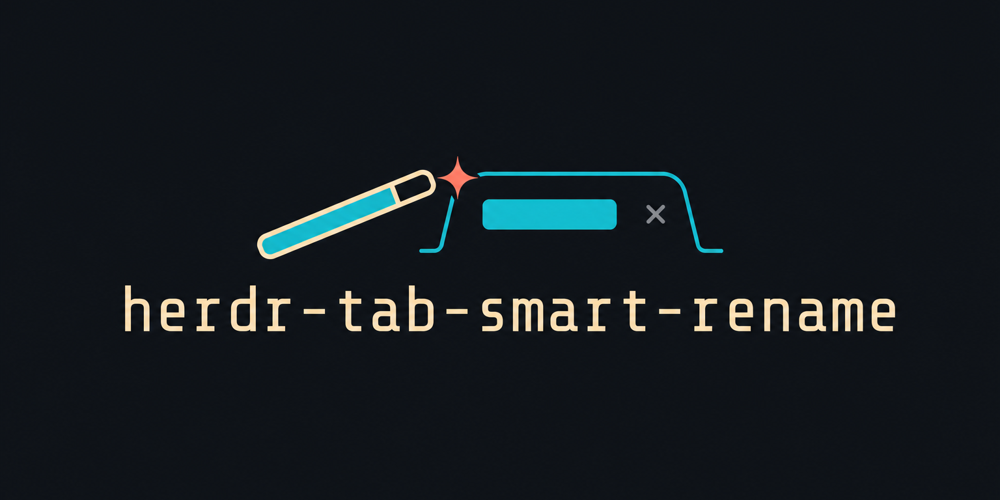

<p align="center">
  
</p>

<h1 align="center">herdr-tab-smart-rename</h1>

<p align="center"><strong>Tabs that say what the work is.</strong></p>

Smart Rename turns default workspace and tab numbers into short task labels while leaving user-chosen names alone.

```text
3  ->  Repair Tab Ownership
4  ->  Run Tests
5  ->  Dev Server
```

Smart Rename labels tabs from their current work—useful when you cannot remember what an agent was doing. Recognized processes get instant deterministic names; ambiguous work uses OpenAI GPT-5.6 Luna by default or another OpenAI-compatible model.

## Demo

https://github.com/user-attachments/assets/c9d12c33-e458-4a29-986c-c403d64aff02

## Install

Requires Herdr 0.7.0 or newer and Bun 1.1.34 or newer.

```sh
herdr plugin install iurysza/herdr-tab-smart-rename
herdr plugin action invoke configure-ai --plugin autoname
herdr plugin action invoke check-ai --plugin autoname
herdr plugin action invoke start --plugin autoname
```

`configure-ai` opens `~/.config/herdr/plugins/config/autoname/provider.env`. Add your OpenAI key:

```dotenv
OPENAI_API_KEY=...
```

The file starts from [`provider.env.example`](provider.env.example), so the endpoint, model, reasoning, and timeout are ready to use. Without a key, deterministic names still work. Model-backed names do not.

## Use

Suggested Herdr bindings:

```toml
[[keys.command]]
key = "prefix+t"
type = "plugin_action"
command = "autoname.rename-now"
description = "smart rename current tab"

[[keys.command]]
key = "prefix+alt+t"
type = "plugin_action"
command = "autoname.rename-all"
description = "force smart rename all tabs"
```

| Action | What it does |
| --- | --- |
| `rename-now` | Rename the current tab now |
| `rename-all` | Rename every tab in sequence |
| `reset-tab` | Return the current tab to automatic naming |
| `reset-workspace` | Return the current workspace to automatic naming |
| `configure-ai` | Edit provider settings |
| `configure-prompt` | Edit the naming instructions |
| `check-ai` | Check provider and prompt settings without making a model request |
| `start` / `stop` / `status` | Control or inspect Smart Rename |

Run any action with:

```sh
herdr plugin action invoke <action> --plugin autoname
```

Explicit rename actions reclaim manual tabs and request fresh names.

## Naming rules

Smart Rename uses the most relevant pane in each tab:

1. the focused agent;
2. another working or blocked agent;
3. the focused command;
4. the first pane.

Tests, development servers, log followers, and remote shells become `Run Tests`, `Dev Server`, `View Logs`, and `Remote Shell`. Agent tasks and unclear commands may use the configured model.

Labels use 2 to 4 Title Case words and no more than 30 characters. Workspaces describe projects. Tabs describe tasks. Manual names always win until you reset or explicitly rename them.

The [naming policy](docs/naming-policy.md) is both the human-readable contract and the default AI system prompt.

## Customize the naming prompt

Run `configure-prompt` to create and open your private copy:

```sh
herdr plugin action invoke configure-prompt --plugin autoname
```

You can replace the default policy with something as short as:

```md
Name the current persistent task.

- Use 2–4 Title Case words, at most 30 characters.
- Start with an action verb.
- Omit project, app, agent, and model names.

Return JSON only: {"tab":"Assess Python Migration","reason":"The user is researching migration effort."}
If unclear: {"tab":null,"reason":"no meaningful task"}
```

Your copy lives at `~/.config/herdr/plugins/config/autoname/naming-prompt.md` and survives plugin updates. To keep the bundled policy instead, do nothing. To use another file, set `SMART_RENAME_PROMPT_PATH` in `provider.env`; relative paths resolve from the plugin config directory.

Smart Rename reloads the prompt before every model request. Output still must satisfy the built-in JSON and label validation.

## Choose a provider and model

The defaults are exposed in [`provider.env.example`](provider.env.example):

```dotenv
SMART_RENAME_PROVIDER=openai
SMART_RENAME_BASE_URL=https://api.openai.com/v1
SMART_RENAME_MODEL=gpt-5.6-luna
SMART_RENAME_REASONING_EFFORT=medium
SMART_RENAME_TIMEOUT_MS=45000
```

Set those values and `SMART_RENAME_API_KEY` to use another OpenAI-compatible provider. `OPENAI_API_KEY` works for OpenAI; `KIMI_API_KEY` works when `SMART_RENAME_PROVIDER=kimi-code`. Reasoning effort accepts `low`, `medium`, or `high` when the model supports it.

Smart Rename reloads `provider.env` before every model request. You do not need to restart the worker after changing it.

## Privacy

To name a tab, Smart Rename may send the most relevant pane's command and recent output to your AI provider. If that pane is running Pi, it may also include short excerpts from your requests so the name reflects the actual task.

Before sending anything, Smart Rename removes terminal formatting, common secrets, and your home-directory path, then limits how much text is included. Other panes contribute process names only—not terminal or chat content.

Smart Rename never starts Pi or reads its credentials. Your AI provider key stays in Herdr's private plugin config and never appears in Smart Rename's state or logs.

## Troubleshooting

- Worker stopped: `herdr plugin action invoke start --plugin autoname`
- Provider missing: run `configure-ai`, save the key, then run `check-ai`.
- Manual label stays unchanged: use `reset-tab` or an explicit rename action.
- No model name appears: the model may have found no meaningful task.
- Worker logs: `herdr plugin log list --plugin autoname --limit 10`

## Project documentation

- [Semantic map](ai-artifacts/SEMANTIC_MAP.md)
- [Architecture](ai-artifacts/ARCHITECTURE.md)
- [Naming policy](docs/naming-policy.md)
