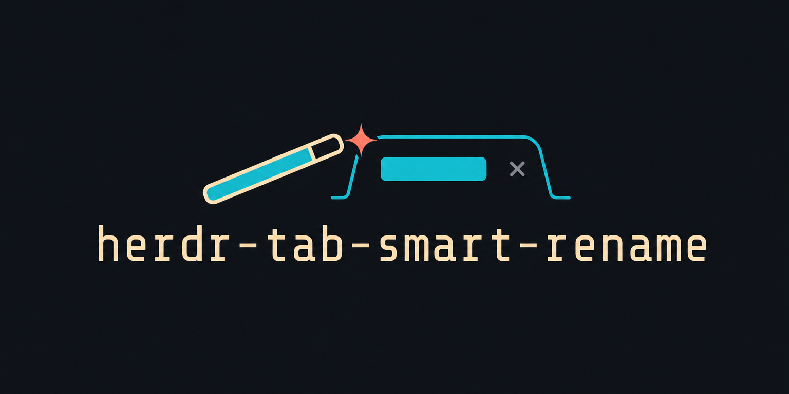

# Smart Rename



Name your Herdr tabs and agent panes after their current task.

An agent reviewing authentication can show `Review Auth Changes`. A test run can show `Run Tests`. Smart Rename updates these labels in the background so you can find the right tab without opening it.

- Give agents separate pane labels, even when they share a tab.
- Keep names you set yourself until you explicitly reset or rename them.
- Name known commands without an AI call. Use a model to interpret other tasks.
- Reuse connected Pi or OpenCode providers, or supply an OpenAI-compatible API key.

## Demo

https://github.com/user-attachments/assets/c1b49f7f-d4a1-4d03-b0cd-e2e98752f7f9

## Install on macOS or Linux

You need Herdr 0.7.0+ and Bun 1.1.34+ installed. Pi and OpenCode are optional.

Run this from a Herdr terminal:

```sh
curl -fsSL https://github.com/iurysza/herdr-tab-smart-rename/releases/latest/download/install.sh | sh
```

The installer installs the plugin and opens setup. Choose a model, confirm, and background naming starts.

For Windows, use the [Herdr installation commands](./docs/install.md#windows). For an existing installation, follow the [upgrade guide](./docs/install.md#upgrade-an-existing-install) or [local-checkout migration](./docs/install.md#move-from-a-local-checkout).

## Choose a model

Using the install wizzard:


Setup offers three sources:

- Direct uses an OpenAI-compatible endpoint, model ID, and API key. Neither Pi nor OpenCode needs to be installed.
- Pi reuses a provider you have connected in Pi, with its models and supported thinking levels.
- OpenCode reuses a provider you have connected in an installed OpenCode, with its models and variants.

To change the model later, reopen setup:

```sh
herdr plugin action invoke setup --plugin tab-smart-rename
```

## Rename your current tab

After setup, use your terminal as usual. Known commands get names such as `Run Tests` or `Dev Server`. For other tasks, Smart Rename asks your selected model for a short label.

To request a name now:

```sh
herdr plugin action invoke rename-now --plugin tab-smart-rename
```

This action can replace a name you set yourself. It affects only the current tab, leaving pane and workspace labels alone. A notification reports the result or explains why the tab was not renamed.

To check or stop background naming:

```sh
herdr plugin action invoke status --plugin tab-smart-rename
herdr plugin action invoke stop --plugin tab-smart-rename
```

Use `start` to resume it. See [actions and shortcuts](./docs/configuration.md) for pane resets, all-tab renames, and keyboard bindings.

## How naming works

Smart Rename uses the focused agent's task to name a shared tab, or another active pane when needed. Supporting servers and logs do not replace an active agent's task. Each recognized agent pane gets its own label.

Background naming preserves manual labels. Weak evidence leaves a name unchanged, and results from closed panes or changed agent sessions are discarded.

Model-backed naming sends bounded terminal context to your selected provider. Pi panes can also contribute short user-request excerpts. Secret redaction is best-effort, and a manual name does not exclude its pane's content. Read [privacy and context](./docs/configuration.md#private-files-and-context) before using it with sensitive work.

## Documentation

- [Installation](./docs/install.md): platforms, upgrades, and migration from a local checkout.
- [Configuration and controls](./docs/configuration.md): actions, shortcuts, model sources, and troubleshooting.
- [Naming policy](./docs/naming-policy.md): the default instructions used to generate labels.
- [Release process](./docs/releasing.md) and [changelog](./CHANGELOG.md).

## Development

Smart Rename runs TypeScript directly with Bun. There is no build step.

```sh
bun install --frozen-lockfile
bun run check
```

On macOS, run tests with the contained runner to keep them away from your real credentials and Herdr sessions:

```sh
bun scripts/test-contained.ts
```

The naming service lives in `src/service.ts`, with model adapters in `src/model-sources/`. See [development](./docs/development.md) for other platforms, integration tests, and linking a checkout to Herdr.
