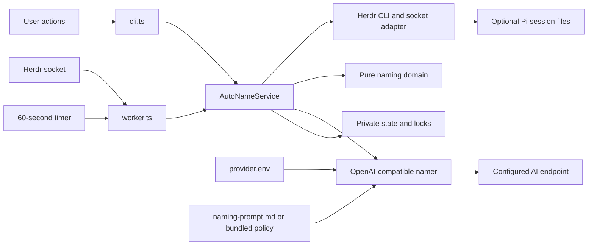
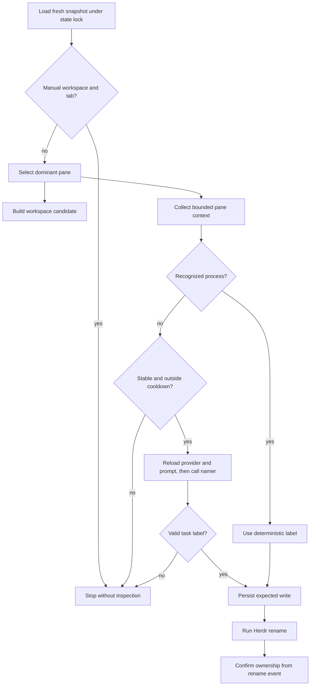

# Architecture

## System Overview

Smart Rename is a local Herdr plugin written in strict TypeScript and executed directly by Bun. A singleton worker reacts to Herdr events and periodic sweeps. CLI actions use the same service for manual renames, resets, configuration, and worker control.

The service prefers deterministic process labels. It calls an OpenAI-compatible model only when task evidence is ambiguous. Persistent ownership records ensure user labels always win.

## Major Components and Responsibilities

| Component | Responsibility |
| --- | --- |
| `cli.ts` | Dispatch plugin actions, control the worker, run explicit evaluations, and show notifications |
| `configure.ts` | Seed private provider and prompt files from tracked templates, then open them in the user's editor |
| `worker.ts` | Subscribe to events, debounce evaluations, run sweeps, serialize work, reconnect, and shut down cleanly |
| `service.ts` | Coordinate snapshots, ownership, context, naming, persistence, and rename writes |
| `domain.ts` | Define contracts and pure policy for labels, ownership, heuristics, prompts, fingerprints, and cooldowns |
| `herdr.ts` | Validate and translate Herdr CLI and socket data |
| `pi-context.ts` | Sample bounded user requests from approved Pi session files |
| `provider.ts` | Resolve file-based defaults and overrides, reload the naming prompt, call the AI SDK, and validate model output |
| `storage.ts` | Manage state paths, private permissions, atomic files, locks, worker identity, and stale recovery |
| `text.ts` | Sanitize and bound text before prompts, state messages, and notifications |

`herdr-plugin.toml` registers 10 actions and two overlay panes. It also installs production dependencies with Bun.

## Integration Points (APIs, queues, external services)

### Herdr

- CLI: snapshots, process information, terminal reads, renames, notifications, and plugin pane control
- Unix socket: LF-delimited lifecycle event subscription
- Environment: plugin root, state directory, config directory, socket path, and focused IDs

### AI provider

- protocol: OpenAI-compatible chat completion through Vercel AI SDK
- default endpoint and model: OpenAI API with `gpt-5.6-luna`
- provider defaults: tracked `provider.env.example`
- user configuration: private `provider.env`, reloaded for every call
- system prompt: bundled `docs/naming-policy.md`, overridden by private `naming-prompt.md` or `SMART_RENAME_PROMPT_PATH`
- request: one non-streaming call, 45-second default timeout, one retry, and a 32,768 output-token ceiling
- reasoning: medium by default; provider overrides may omit or replace it

### Local files and processes

- Pi session JSONL: optional task context for detected Pi panes
- Git: repository root fallback for workspace identity
- state directory: ownership records, model gates, worker PID, locks, and logs
- config directory: private `provider.env` and optional `naming-prompt.md`
- editor process: provider and prompt configuration panes

There is no external queue. The worker uses an in-memory promise chain to serialize tasks and a file lock to serialize state across the worker and CLI actions.

## Runtime Flow (request path, async jobs, background workers)

### Worker start

1. The `start` action acquires the start lock.
2. It verifies any recorded PID against the exact worker script.
3. It spawns detached `bun src/worker.ts` and writes private worker metadata.
4. The worker reconciles the current Herdr snapshot with persisted ownership.
5. It starts the event subscription and 60-second sweep.

### Background event

1. Herdr emits a workspace, tab, or pane lifecycle event.
2. The worker validates and normalizes the event.
3. Rename events acknowledge automatic writes or mark manual ownership.
4. Other relevant events resolve a tab and schedule evaluation after 400 milliseconds.
5. The promise queue runs the service evaluation serially.

### Evaluation

### Explicit action

`rename-now` and `rename-all` reset automatic ownership for their target tabs. They bypass stability and cooldown gates, then report renamed, unchanged, abstained, or failed outcomes through Herdr notifications.

### Shutdown and recovery

- SIGTERM and SIGINT stop timers, destroy the socket, wait for queued work, and remove only the owned PID file.
- Socket closure schedules reconnect after one second.
- Dead lock owners and stale worker records are removed after verification.
- Failed rename commands restore the prior ownership record.

## Key Tradeoffs and Constraints

- Direct Bun execution removes a JavaScript build step but requires Bun 1.1.34 or newer on every host.
- Zod schemas add boundary code but prevent external JSON from becoming trusted TypeScript data by assertion.
- A coarse state lock simplifies cross-process correctness. It also serializes model-backed evaluations.
- Deterministic labels avoid model latency and cost. Broad AI naming remains available for ambiguous tasks.
- The 4,500-character context cap limits exposure and cost but can omit older evidence.
- GPT-5.6 Luna suits short, high-volume naming, while medium reasoning trades some latency for label quality.
- Editable prompts enable personal naming style but may produce rejected output; schema and label validation remain fixed safety boundaries.
- Provider configuration is portable across OpenAI-compatible endpoints, but reasoning support varies by provider.
- Pi is a context source, not an inference dependency. Smart Rename never reads Pi credentials or starts Pi.
- One worker serves the local Herdr socket. Named or remote socket discovery is not automatic.
- Closed ownership records and worker logs are not pruned or rotated.

Updated-at: 965b2ab6bf3c83760aea70fa6de27bc0972e0fcf
