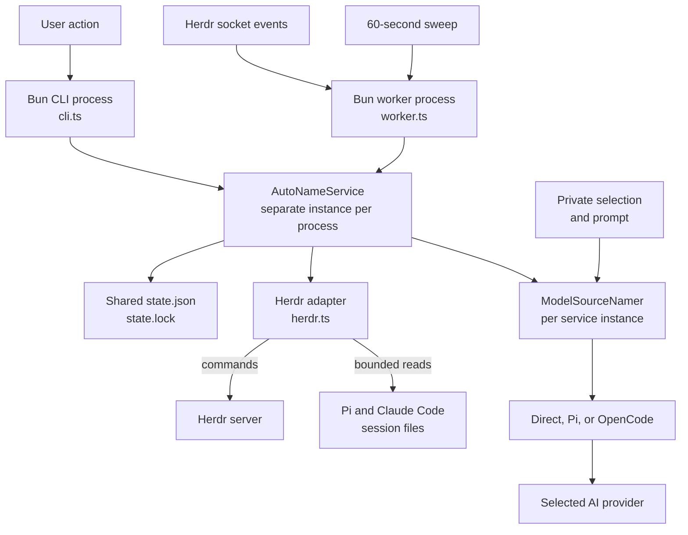

# Architecture overview

Smart Rename is a local Herdr plugin executed directly by Bun. A background worker and short-lived CLI actions share `AutoNameService`, which chooses names and protects manual labels. Model sources suggest text; the service decides whether that text may become a label.

[Knowledge base](README.md) · [Naming glossary](CONTEXT.md) · [Code and test map](SEMANTIC_MAP.md)

## Running processes and external systems

```mermaid
flowchart TB
    User["User action"] --> CLI["Bun CLI process<br/>cli.ts"]
    Events["Herdr socket events"] --> Worker["Bun worker process<br/>worker.ts"]
    Timer["60-second sweep"] --> Worker
    CLI --> Service["AutoNameService<br/>separate instance per process"]
    Worker --> Service
    Service --> State["Shared state.json<br/>state.lock"]
    Service --> Adapter["Herdr adapter<br/>herdr.ts"]
    Adapter -->|commands| Herdr["Herdr server"]
    Adapter -->|bounded reads| Sessions["Pi and Claude Code<br/>session files"]
    Service --> Namer["ModelSourceNamer<br/>per service instance"]
    Config["Private selection<br/>and prompt"] --> Namer
    Namer --> Routes["Direct, Pi, or OpenCode"]
    Routes --> Provider["Selected AI provider"]
```

The Herdr socket and command routes reach the same server. The service box represents separate instances, not a shared process. The worker and an explicit action can evaluate the same target in different processes. Their in-memory queues do not coordinate each other. The shared state lock and persisted decision IDs do.

[The manifest](../herdr-plugin.toml) registers the actions and setup panes. [CLI dispatch](../src/cli.ts) and [worker startup](../src/worker.ts) construct the service through `createService` in [service.ts](../src/service.ts). The [model router](../src/model-namer.ts) loads only the selected model source.

## Responsibilities that must remain separate

The pure functions in [domain.ts](../src/domain.ts) define label validity, ownership transitions, context selection, and retry policy. `AutoNameService` combines those rules with snapshots, context reads, persistence, and rename commands through `ServiceDependencies`.

The Herdr adapter parses external data and performs commands. The model adapter receives bounded naming context and returns a suggestion; it cannot rename a target. [storage.ts](../src/storage.ts) owns file validation, atomic replacement, state transactions, and worker identity checks.

[Contracts and boundaries](architecture/contracts-and-boundaries.md) describes the data at each boundary. [Naming flow](architecture/naming-flow.md) follows one evaluation from target selection to its result.

## Four rules explain most behavior

- A manual pane label protects that pane's label, but its task can still name the tab. Explicit actions reclaim only their selected target kind.
- Context reads and model latency happen outside the shared state lock. A fresh snapshot, ownership check, source identity, and decision ID guard the eventual write.
- Workspace identity and known commands can produce candidates without inference. Pi and Claude Code panes normally wait for a user request before a model call.
- The selected model source owns the request. A Pi or OpenCode failure does not silently fall back to Direct.

The first two rules are covered by [service tests](../test/service.test.ts) and [race-condition tests](../test/reliability.test.ts). [Startup tests](../test/agent-startup.test.ts) verify the first-request behavior. [Model routing tests](../test/model-namer.test.ts) verify the no-fallback boundary.

## Where the difficult behavior lives

[Ownership and concurrency](architecture/ownership-and-concurrency.md) explains expected writes, late responses, independent event handling, worker readiness, and progress markers. It also states the remaining race between the final snapshot and Herdr's rename command.

[Model sources and setup](architecture/model-sources-and-setup.md) explains credential ownership, source lifetime, cancellation, and configuration rollback. Setup commits validated configuration before starting the worker, so startup failure does not discard valid settings.

The plugin keeps private configuration and runtime state outside the release checkout. [Configuration and controls](../docs/configuration.md) documents their locations and precedence. [Development](../docs/development.md) describes contained tests that avoid the real worker and credentials.

## Limits of the guarantees

Herdr does not expose a compare-and-set rename through this adapter. A manual edit between the final snapshot and the rename command can still race. Closing a pane invalidates its pending result but does not cancel an already-sent model request.

Context is bounded and sanitized, but secret redaction is best-effort. Manual naming does not opt a pane out of context collection. A valid schema proves shape and label policy, not that a suggestion accurately describes the task.
