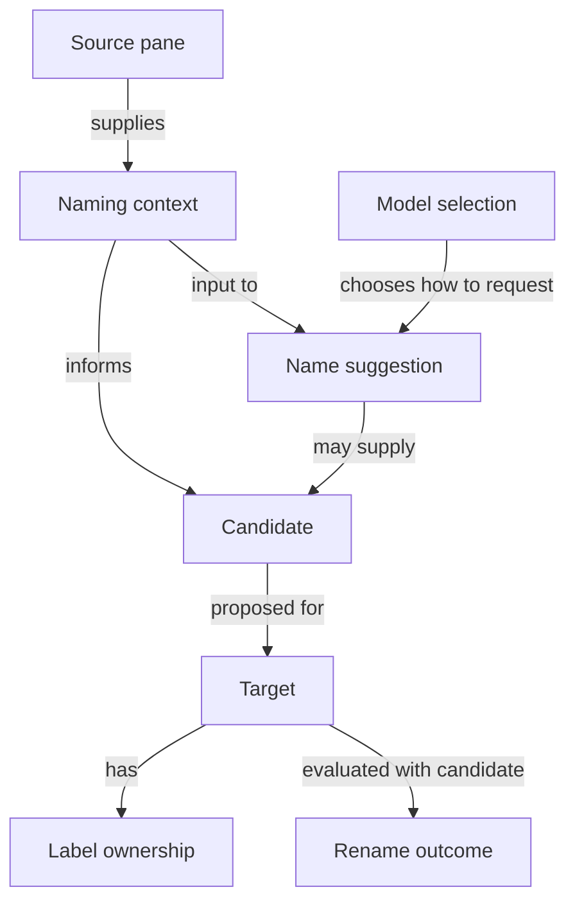

# Naming language

Smart Rename names workspaces, tabs, and agent panes. Each label has independent ownership, even when several labels describe the same task.

[Knowledge base](README.md) · [Architecture](ARCHITECTURE.md)

## Model

A candidate may come from a known command or workspace identity without a model call. A name suggestion can abstain. Even a valid candidate may be discarded before a rename.

## Language

### Labels and evidence

**Target**:
The workspace, tab, or agent pane whose label Smart Rename may change. A tab and its panes are separate targets.
_Avoid_: Calling every target a tab.

**Source pane**:
A pane whose task evidence informs a target's candidate. A manually named pane can still be a source pane for its tab.
_Avoid_: Dominant pane, or treating manual ownership as exclusion from context.

**Workspace identity**:
The project identity used for a workspace label and as context for task naming. It is distinct from the current task of a tab or pane.
_Avoid_: Task name when referring to a project.

**Naming context**:
The bounded evidence supplied to a namer: project identity with user requests, or with process and terminal evidence. It does not contain every piece of pane data that was collected.
_Avoid_: Full session, transcript dump.

**Candidate**:
A proposed label for a target. Having a candidate does not guarantee a rename.
_Avoid_: Applied label, successful rename.

**Name suggestion**:
A model's validated task label and reason, or an abstention with a reason. A suggestion can inform either a tab or an agent pane.
_Avoid_: Treating the response field `tab` as proof that only tabs can use it.

**Abstention**:
A valid model response that supplies no meaningful task label. It leaves the label unchanged and differs from a failed request.
_Avoid_: Error, invalid response.

### Ownership and results

**Label ownership**:
Whether Smart Rename may update one target's label automatically. Ownership of a pane label does not control ownership of its tab label.
_Avoid_: Tab-wide lock.

**Manual ownership**:
The user's claim on one target's label. Background naming preserves it until an explicit reset or rename of that target.
_Avoid_: Privacy exclusion, protected context.

**Expected write**:
The automatic label recorded before Smart Rename asks Herdr to apply it. The matching label lets Smart Rename recognize its own write.
_Avoid_: Manual rename, completed write.

**Decision ID**:
The identity of the evaluation currently allowed to apply a result to a target. A newer decision makes an older result ineligible.
_Avoid_: Session ID, lock.

**Rename outcome**:
The result for one target: renamed, unchanged, skipped, or failed. One tab evaluation can contain different outcomes for the workspace, tab, and panes.
_Avoid_: Treating one failed target as failure of every target.

### Models and sessions

**Agent session**:
The conversation identified by a pane's agent metadata. A new session in the same pane is a new source of task evidence.
_Avoid_: Herdr session, model selection.

**Herdr session**:
The Herdr server reached through the target socket. Worker ownership identifies which Herdr session a recorded worker serves.
_Avoid_: Agent conversation.

**Model source**:
The route used to discover and call a model: Direct, Pi, or OpenCode. The pane supplying task evidence does not determine the model source.
_Avoid_: Provider, source pane.

**Model selection**:
The chosen model source, provider, model, and optional profile. It contains selection metadata, not credentials or a naming candidate.
_Avoid_: Naming decision, API key.

The [naming flow](architecture/naming-flow.md) applies these distinctions. The [contract reference](architecture/contracts-and-boundaries.md) maps them to TypeScript types.
