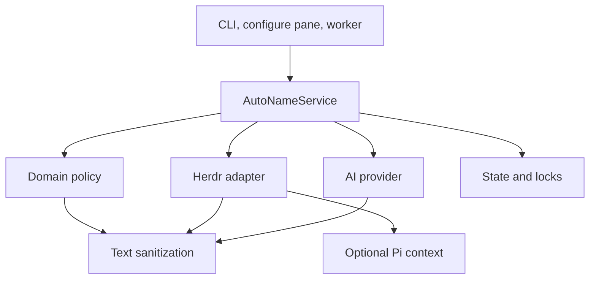
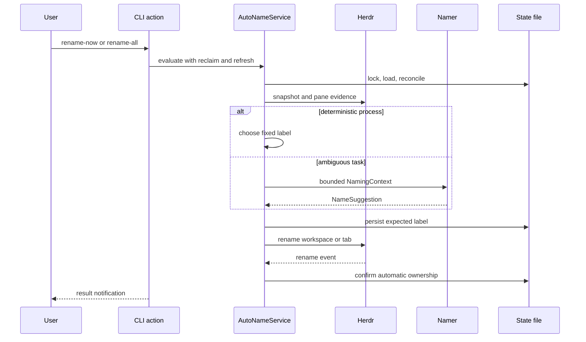

# Semantic map

Smart Rename turns live Herdr activity into stable workspace names and current-task tab names. The code separates naming policy from context collection, provider access, persistence, and runtime control.

## Domain Concepts

| Concept | Meaning | Owner |
| --- | --- | --- |
| Workspace identity | Stable project identity from the worktree, existing label, Git root, or pane directory | `domain.ts` |
| Tab task | The current persistent task, expressed as a 2 to 4 word label | `domain.ts` |
| Ownership | Whether Smart Rename or the user controls a label | `domain.ts`, `storage.ts` |
| Expected write | A rename recorded before Herdr applies it, so its event is not mistaken for a manual rename | `domain.ts`, `service.ts` |
| Dominant pane | The pane that supplies task evidence: focused agent, active agent, focused command, then first pane | `service.ts` |
| Naming context | Bounded project, process, terminal, and optional Pi session evidence sent to the namer | `domain.ts`, `herdr.ts`, `pi-context.ts` |
| Name suggestion | A validated label and reason, or `null` when evidence does not describe a task | `provider.ts` |
| Rename result | Candidate names, ownership state, model usage, reason, and applied changes | `domain.ts`, `service.ts` |
| Churn gate | Fingerprints, stability observations, and model cooldowns that prevent repeated calls | `domain.ts` |
| Provider configuration | Endpoint, model, key, timeout, and optional reasoning effort reloaded for each request | `provider.ts`, `configure.ts` |

## Technical Layers

| Layer | Files | Responsibility |
| --- | --- | --- |
| Entrypoints | `cli.ts`, `configure.ts`, `worker.ts` | Translate Herdr actions and events into service calls |
| Orchestration | `service.ts` | Reconcile ownership, collect context, choose a naming path, and apply safe writes |
| Domain | `domain.ts` | Hold pure naming, ownership, validation, context, and churn rules |
| Herdr integration | `herdr.ts` | Run Herdr commands, validate snapshots, inspect panes, rename labels, and frame socket events |
| Pi context | `pi-context.ts` | Read bounded user requests from allowed Pi session files |
| Provider | `provider.ts` | Load configuration, call one OpenAI-compatible model, and validate its answer |
| Persistence | `storage.ts` | Validate state, write atomically, serialize processes, and verify the singleton worker |
| Text safety | `text.ts` | Strip terminal controls, redact secrets, normalize paths, and bound text |

## Cross-Cutting Concerns

- Manual ownership: manual labels stop inspection, provider calls, and writes until reset or explicit reclaim.
- Bounded data: terminal output, process fields, session windows, provider files, prompts, errors, and notifications all have limits.
- Secret safety: `strip-ansi` and `secret-sniff` handle common terminal and credential forms before data leaves the machine.
- Runtime validation: Zod validates Herdr JSON, Pi records, provider configuration, model output, state, locks, and worker metadata.
- Concurrency: one cross-process state lock covers reconciliation, model gates, expected writes, and rename rollback.
- Resilience: the worker serializes tasks, debounces tab events, sweeps every 60 seconds, and reconnects after socket closure.
- Provider independence: Pi supplies optional context only. Model authentication comes from Smart Rename's private provider file.
- Feedback: explicit actions emit start, success, no-change, and sanitized failure notifications.

## Data Flow Paths

### Explicit rename

### Background naming

1. `worker.ts` subscribes to Herdr lifecycle events.
2. It resolves the affected tab and debounces evaluation by 400 milliseconds.
3. `AutoNameService` runs evaluations through one promise queue and one state transaction at a time.
4. A 60-second sweep catches task changes without lifecycle events.
5. Fingerprints and cooldowns suppress unchanged model work.

### Provider configuration

1. `configure-ai` opens `provider.env` in Herdr's overlay pane.
2. `provider.ts` reads at most 16 KiB for every request.
3. Process values override file values.
4. Zod validates the merged configuration.
5. The AI SDK sends one non-streaming OpenAI-compatible request.

## Data Boundaries and Transformations

| Boundary | Input | Transformation | Output |
| --- | --- | --- | --- |
| Herdr snapshot | CLI JSON | JSON parse and Zod validation | `HerdrSnapshot` |
| Herdr event socket | LF-delimited envelopes | framing, JSON parse, normalization, Zod validation | `HerdrEvent` |
| Pane process | Herdr process-info JSON | field selection, sanitization, length limits | `ProcessInfo` |
| Pane output | recent terminal text | ANSI removal, secret redaction, whitespace normalization, 1,000-character cap | safe output evidence |
| Pi session | path-backed JSONL | root check, regular-file check, bounded head/middle/tail windows, user-message validation | `SessionTimeline` |
| Provider file | private dotenv text | 16 KiB bound, dotenv parse, process override, Zod validation | `ProviderConfig` |
| Model prompt | pane evidence | dominant-pane selection, sanitization, timeline weighting, 4,500-character hard cap | `NamingContext` |
| Model response | provider text | JSON fence removal, JSON parse, Zod validation, title policy | `NameSuggestion` |
| State file | JSON on disk | lock, Zod validation, reconciliation, atomic temporary-file rename | `SmartRenameState` |
| Herdr rename | candidate label | expected-write persistence before command | confirmed automatic ownership or rollback |

Updated-at: 89a7d226f3817e0cb9bee32cc2ed5c5992c09ae9
