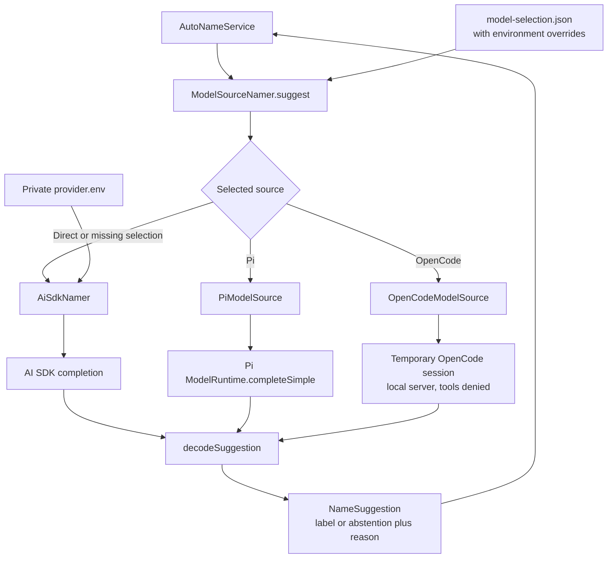
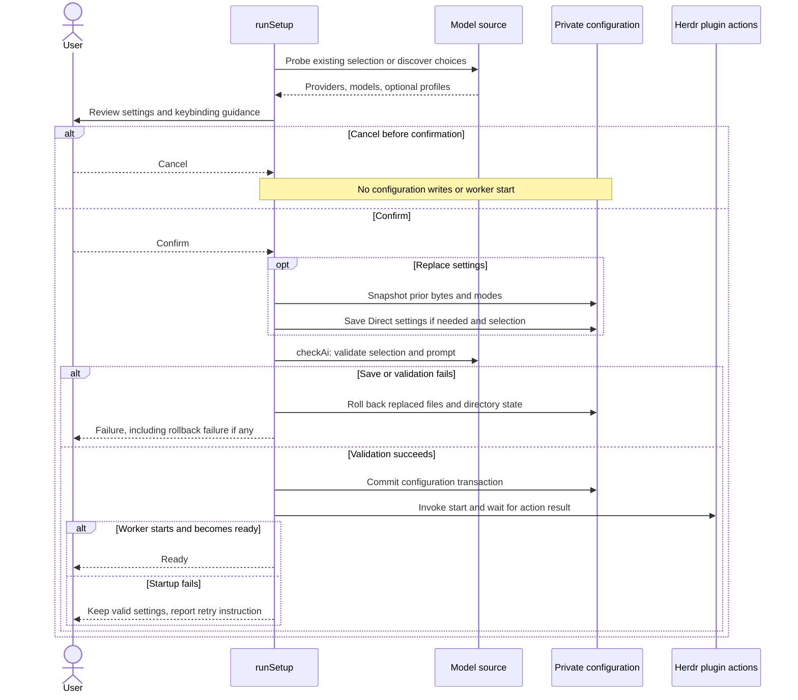

# Model sources and setup

Model selection changes how inference runs, not which panes supply context or which labels may change. The service always owns target selection and writes. Every inference route returns through the same label-validation policy.

[Knowledge base](../README.md) · [Overview](../ARCHITECTURE.md) · [Glossary](../CONTEXT.md)

## One naming interface, three inference routes

The service calls `Namer.suggest(context)`. The default implementation is `ModelSourceNamer`, which loads selection metadata at the start of each queued suggestion.

[model-selection.ts](../../src/model-selection.ts) validates a versioned selection containing source, provider, model, and optional profile. A missing file selects Direct for existing installations; an invalid file is an error. The Direct path resolves its actual endpoint, model, and credentials from Direct configuration rather than using the missing-selection sentinel values.

The selected-source cache is keyed by the full selection. A change closes the previous source before loading another. Returning to Direct also closes the active optional source. The serial request queue in [model-namer.ts](../../src/model-namer.ts) prevents overlapping suggestions from closing each other's adapter.

A selected-source error is reported as a failure. There is no automatic fallback to another source or provider. [Model routing tests](../../test/model-namer.test.ts) verify default Direct behavior, selection propagation, failure handling, and source closure.

## Credential and tool boundaries

| Source | Who resolves credentials | Request mechanism | Tool and resource behavior |
| --- | --- | --- | --- |
| Direct | Smart Rename's private Direct configuration and environment | AI SDK, OpenAI-compatible completion | No agent session or tools; provider and prompt reload for each request |
| Pi | Pi's model runtime | `completeSimple` with a system prompt and one user message | No Pi agent loop or tool execution; runtime resources are loaded lazily |
| OpenCode | Installed OpenCode | Local server and temporary session using SDK v2 | All session permissions denied, enumerated tools explicitly disabled; session deletion attempted and server closed afterward |

The Pi adapter uses Pi's public runtime rather than copying credentials into Smart Rename's selection file. `allowModelNetwork: false` configures runtime creation; it does not make the eventual provider completion offline.

OpenCode may still expose tool definitions to the provider. Session permissions are the execution boundary, not an assumption that the prompt contains no tools. The adapter passes the request abort signal to provider discovery, tool discovery, session creation, prompt, and deletion. Cleanup is best-effort: deletion can fail, including when the same signal is already aborted, but `finally` still closes the owned server.

Evidence: [Pi adapter](../../src/model-sources/pi.ts), [OpenCode adapter](../../src/model-sources/opencode.ts), [Pi adapter tests](../../test/pi-model-source.test.ts), [OpenCode adapter tests](../../test/opencode-model-source.test.ts), and opt-in [real-runtime tests](../../test/harness-runtime.test.ts).

## Timeouts and response validation

Direct wraps the completion with an Effect timeout using the configured timeout. It passes an abort signal to the SDK and requests one retry. Pi and OpenCode receive a 45-second abort signal from `ModelSourceNamer`. Pi receives the token and retry options; OpenCode maps the request to its session API and does not pass those numeric options through. Do not assume identical retry behavior across adapters.

Timeouts are request limits, not per-target cancellation. Closing a pane does not abort the request. The service discards its stale result later. The timeout for an optional source is created when that suggestion starts running, not while it waits in the namer's queue.

[decodeSuggestion](../../src/effect/model-output.ts) accepts JSON, optionally inside a Markdown fence, with a string or null `tab` field and a string `reason`. Effect Schema validates the payload, then `validateTabLabel` enforces the task-label policy. `parseSuggestion` in [provider.ts](../../src/provider.ts) exposes that decoder to optional sources. Direct composes the decoder into its Effect request.

A null label is a valid abstention. Invalid JSON, an invalid label, and request failures are failures, with retry behavior owned by the service. Sanitization limits error exposure; it does not make every external error safe by construction.

Evidence: [provider tests](../../test/provider.test.ts), [model-namer.ts](../../src/model-namer.ts), and [provider.ts](../../src/provider.ts). The [contract reference](contracts-and-boundaries.md) gives the exact shared interfaces.

## Setup commits before worker startup

Setup collects choices and shows a review before saving. Discovery may load an adapter, but cancellation before confirmation writes no settings and starts no worker. Keybinding inspection produces instructions without editing the user's Herdr configuration.

`beginSetupTransaction` snapshots `model-selection.json` and, for Direct replacement, `provider.env`. Rollback restores prior bytes and permissions or removes newly created files. This is file-level compensation, not one atomic multi-file transaction or a lock against concurrent setup processes.

After validation succeeds, `commit()` disables rollback. A later worker-start failure keeps the valid configuration. `HerdrPluginClient.invokeAndWait` tracks the invoked action's log ID, and `start` itself waits for socket readiness. `check-ai` validates configuration and prompt but does not make a naming completion; success is not proof that a provider request will succeed.

Evidence: [setup.ts](../../src/setup.ts), [setup-transaction.ts](../../src/setup-transaction.ts), [Herdr plugin client](../../src/herdr-plugin-client.ts), [setup cancellation tests](../../test/setup.test.ts), [rollback tests](../../test/setup-transaction.test.ts), and [action-receipt tests](../../test/herdr-plugin-client.test.ts).

For paths, environment precedence, and user commands, use [configuration and controls](../../docs/configuration.md).
