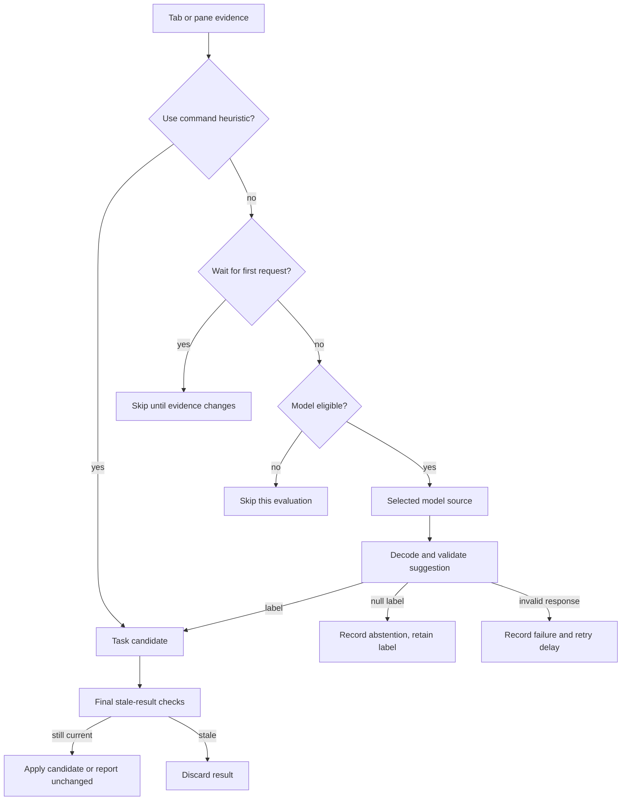
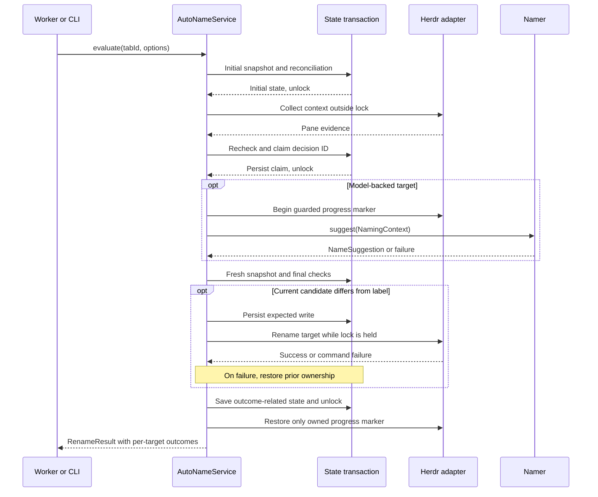

# Naming flow

A tab evaluation may name its workspace, the tab, and each recognized agent pane. Those targets have separate ownership and outcomes. The evaluation can rename one target, skip another, and report a failure for a third.

[Knowledge base](../README.md) · [Overview](../ARCHITECTURE.md) · [Glossary](../CONTEXT.md)

## Entry points choose the target scope

[CLI dispatch](../../src/cli.ts) and [the worker](../../src/worker.ts) call the same `AutoNameService.evaluate` implementation in [service.ts](../../src/service.ts).

| Entry point | Targets considered | Reclaims manual ownership | Bypasses model gates |
| --- | --- | --- | --- |
| Worker evaluation or `once` | Workspace, tab, and agent panes | No | No |
| `rename-now` or `reset-tab` | Current tab | Yes, tab only | Yes |
| Manifest action `rename-all`, dispatched as `all` | Each tab | Yes, tabs only | Yes |
| `reset-pane` | Current agent pane | Yes, pane only | Yes |
| `reset-workspace` | Current workspace | Yes, workspace only | Workspace naming needs no model |

Explicit refresh does not force inference when a process heuristic supplies a name. The service's `forceModel` option bypasses that heuristic, but the normal rename actions pass `forceRefresh` instead.

`dry-run` suppresses state-file writes, rename commands, and progress markers. The CLI may still create or secure the configured state directory. It can collect context and call the configured model, so it is not an offline simulation.

Evidence: [manifest actions](../../herdr-plugin.toml), `once`, `renameAll`, and `renameNow` in [cli.ts](../../src/cli.ts); exact target-scope cases in [reliability.test.ts](../../test/reliability.test.ts).

## Evidence follows the target

For a tab, `focusedPaneFor` chooses the focused agent first, then an agent marked `working` or `blocked`, then the focused pane, then the first pane. A supporting command therefore does not displace a working agent just because it has focus.

The service reads full context for the chosen source pane and process summaries for siblings. A pane target uses only its own context. Workspace naming uses `workspaceCandidate`, with this precedence: worktree repository name, existing non-default workspace label, Git root, then a pane directory fallback.

`focusedPaneContext` in [herdr.ts](../../src/herdr.ts) collects process information, recent terminal text, and bounded session messages. [pi-context.ts](../../src/pi-context.ts) reads Pi and Claude Code user requests. These are evidence sources, independent of the selected inference source. A Claude Code pane can be named through Direct, Pi, or OpenCode.

`buildModelContext` in [domain.ts](../../src/domain.ts) chooses one of three context shapes:

- project plus an origin, middle, and recent session timeline
- project plus user requests when no populated timeline is available
- project plus process and terminal evidence, with optional sibling process summaries

When user requests are present, the outgoing context excludes terminal evidence. Collection and transmission are different boundaries: terminal data may have been read even when it is not sent. Every context must fit within 4,500 serialized JSON characters.

Evidence: [context tests](../../test/context.test.ts), [domain context tests](../../test/domain.test.ts), and the manual-pane and independent-pane cases in [service.test.ts](../../test/service.test.ts).

## Candidate selection and model eligibility

This diagram covers task naming; workspace identity produces a candidate without these model gates. Transport failures also enter the failure path. `heuristicTitle` matches known command invocations, not arbitrary command output. A user request takes precedence over a heuristic, and `forceModel` disables the shortcut.

For non-agent process context, `observeStableContext` requires the same context twice before inference. Other agents without a transcript reader can use terminal context without that stability wait. Pi and Claude Code normally wait for their first user request instead.

`shouldCallModel` applies the following policy per target:

| Situation | Next eligible attempt |
| --- | --- |
| Ordinary changed context | After the ten-minute interval since the last attempt |
| First task context for an unnamed agent session | After a 30-second gap since the last attempt |
| Valid abstention | Only after the context changes; process context also needs its cooldown |
| Failed call for the same session | At the recorded retry time; exponential delay starts at 30 seconds and caps at ten minutes |
| Explicit refresh or `forceModel` | Bypasses these gates, but not final ownership and stale-result checks |

A successful model label records the context fingerprint and the named session. Unchanged successful context normally produces no new call. State tracks the last eight named sessions per target. Workspace and deterministic labels do not consume model attempts.

Evidence: `shouldCallModel` and the `markModel*` functions in [domain.ts](../../src/domain.ts); [retry and session tests](../../test/domain.test.ts); [first-request tests](../../test/agent-startup.test.ts).

## One evaluation from read to write

Context promises are cached per pane within one evaluation. Model suggestions with identical context fingerprints are also shared within that evaluation. These caches do not persist between evaluations.

A target failure does not prevent subsequent targets from being evaluated. `rename-now` and `rename-all` translate failed outcomes into notifications and a nonzero exit status. The worker logs failed outcomes and continues. See [runtime tests](../../test/runtime.test.ts) and [service failure tests](../../test/service.test.ts).

For the state transitions and limits behind the final recheck, continue to [ownership and concurrency](ownership-and-concurrency.md).
