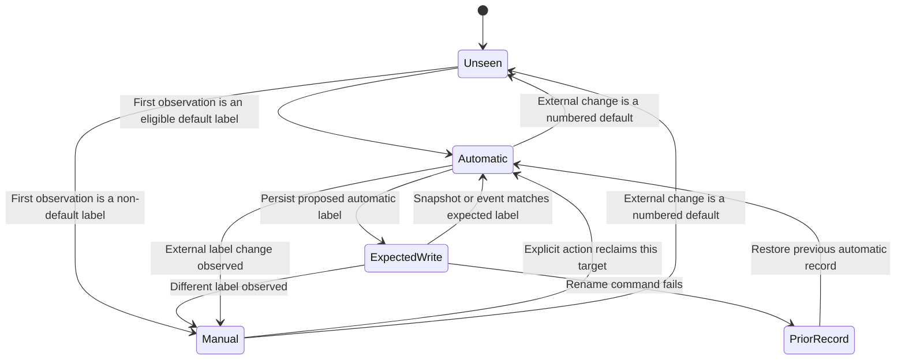
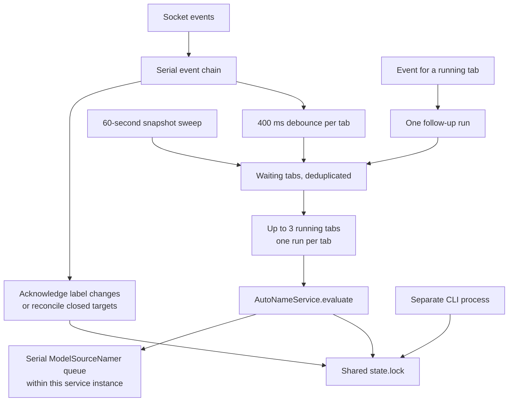

# Ownership and concurrency

The worker and explicit actions can race. Smart Rename coordinates their state changes with a file lock and rejects results that no longer belong to the current target or source pane. The model request itself runs outside that lock.

[Knowledge base](../README.md) · [Overview](../ARCHITECTURE.md) · [Glossary](../CONTEXT.md)

## Ownership belongs to one label

`OwnershipRecord` in [domain.ts](../../src/domain.ts) stores `manual`, `autoLabel`, `expectedLabel`, and `observedLabel`. The following diagram summarizes behavior; these are conceptual states, not a TypeScript discriminated union.

`reconcileItem` compares the current snapshot with the stored record. `acknowledgeRename` recognizes a matching expected write and ignores unchanged older events that must not consume it. `AutoNameService.acknowledge` first checks the live snapshot, so a delayed label event cannot overwrite newer knowledge.

A numbered default observed after a named label is Herdr resetting an unnamed target (renumbering or a cleared name), not a manual edit: `reconcileItem` and `acknowledgeRename` release ownership so automatic naming resumes. The release skips empty pane labels, which are the unnamed pane state, and pending `expectedLabel` writes: a reset that supersedes an in-flight write locks manual on acknowledge, and the next reconcile of the still-numbered label releases it. `resetOwnership` also drops `autoLabel`, so a later snapshot that shows the previous automatic name instead of the number reads as a manual rename and re-locks it.

An explicit action resets ownership only for its target scope. A manually named pane remains available as evidence for tab naming. `reconcileSnapshot` removes ownership and request records for closed items.

Evidence: [ownership tests](../../test/domain.test.ts), [scope and pane tests](../../test/service.test.ts), and the unchanged-event and delayed-event cases in [reliability.test.ts](../../test/reliability.test.ts).

## Three checks around slow work

`AutoNameService.evaluate` uses separate transactions for initial reconciliation, claiming a decision, and applying its result. Context collection happens between the first two. Model work happens between the last two.

Before claiming a decision, the service checks that no newer evaluation has replaced the decision ID captured at the start. This rejects a slow context read that finishes after a newer explicit request. Before writing a result, it checks:

1. The target still exists and a pane target is still an agent.
2. The source panes still have the same identities.
3. The target has not become manually owned.
4. The persisted decision ID still matches this evaluation's ticket.

`paneIdentity` includes pane, tab, workspace, agent, agent-session metadata, and effective working directory. For a tab named from process context, all contributing panes are checked. For request-based tab context, the selected source pane is checked. Pane naming checks that pane alone.

Decision IDs remain after completion. Deleting them as soon as a model finishes would allow an older context read to claim the target later. A discarded stale answer restores its attempt timestamp where the code can prove that timestamp still belongs to it, rather than imposing a new cooldown.

Evidence: `paneIdentity`, the claim transaction, and the final transaction in [service.ts](../../src/service.ts). [Reliability tests](../../test/reliability.test.ts) cover closed sources, replacement sessions, late context reads, superseding explicit requests, and discarded-answer cooldowns.

## The state lock does not cover inference

`withStateTransaction` in [storage.ts](../../src/storage.ts) acquires `state.lock`, loads and validates `state.json`, runs the operation, persists, and releases the lock. `saveState` replaces the file through a temporary file and rename. Known state fields are validated; extra top-level fields survive through the extensible state schema.

The final transaction persists an expected write before issuing the Herdr rename. It keeps the lock through that command. If the command fails, it restores and persists the previous ownership record. This ordering lets other plugin processes recognize the automatic write.

Atomic file replacement protects the state file, not the external label. Herdr's rename command has no expected-label parameter in this adapter. A manual edit after the final snapshot but before the command can still be overwritten. The [reliability repair log](../goals/rename-reliability/dev-log.md) records that limitation and the original API inspection.

State locks contain a PID and nonce. Release removes only a lock with the same nonce. A dead owner or an aged lock can be recovered; age-based recovery also means the lock is not an unlimited lease. Missing state starts empty, while invalid state data can fail validation rather than silently reset ownership.

## Worker concurrency has three separate scopes

The worker handles events independently of model evaluations. An event for a running tab records one follow-up evaluation. `evaluateAll` also evaluates up to three tabs concurrently, but its batch loop is separate from the worker's scheduler.

`ModelSourceNamer` serializes its own suggestions because switching selections closes the previous adapter. Without serialization, one suggestion could close another's connection. This queue belongs to a single namer instance; separate CLI processes have separate queues. Cross-process correctness still depends on persisted state and final checks.

Evidence: [worker.ts](../../src/worker.ts), `evaluateAll` in [service.ts](../../src/service.ts), [model-namer.ts](../../src/model-namer.ts), and the concurrent-tab case in [reliability.test.ts](../../test/reliability.test.ts).

## Progress markers do not claim a manual label

`beginProgress` in [herdr.ts](../../src/herdr.ts) prefixes a label with an invisible ownership marker and a static `◆`. A tab marker covers model work in its evaluation; pane inference also marks that pane. This applies to background and explicit naming.

The helper does not nest an existing marker. Cleanup restores the previous label only if the live label exactly matches the marker it wrote. A successful rename or manual edit therefore survives cleanup. The worker filters progress events, and reconciliation compares base labels with the marker removed. Legacy animated marker forms remain readable for recovery.

Progress is cosmetic. A failed marker write or restoration does not hide the naming result. [Progress tests](../../test/progress.test.ts) cover manual edits, new names, another process's marker, and empty pane labels.

## Startup, reconnect, and shutdown

`start` in [cli.ts](../../src/cli.ts) holds `start.lock`, verifies the recorded worker's process and script, and checks socket ownership. A live worker for another socket blocks startup. A newly spawned worker records readiness after connecting to its target socket; `start` waits for that record rather than treating a PID as readiness.

On socket closure, the worker schedules reconnect after one second. Its 60-second sweep can discover changes without a matching event. Shutdown stops scheduling, clears timers, destroys the socket, waits for event handling and active evaluations, closes the namer, and removes only its own worker record. Waiting evaluations are not all executed during shutdown.

Pane closure makes a result stale; it does not cancel an already-sent completion. Worker shutdown waits for active work rather than broadcasting a cancellation to every source. Adapter request timeouts are a separate mechanism, described in [model sources and setup](model-sources-and-setup.md).

Evidence: [runtime tests](../../test/runtime.test.ts), [isolated worker-readiness test](../../test/worker-readiness.integration.test.ts), and [worker.ts](../../src/worker.ts). Worker logs are stored in `worker.log`; this implementation does not rotate them.
